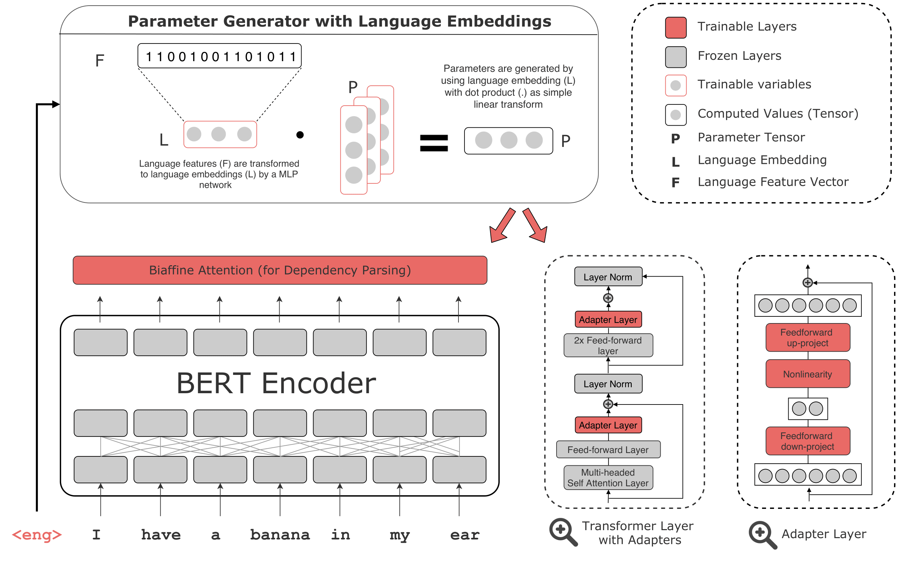

# UDapter

[](LICENSE)

UDapter is a multilingual dependency parser that uses "contextual" adapters together with language-typology features for language-specific adaptation. This repository includes the code for "[UDapter: Language Adaptation for Truly Universal Dependency Parsing](https://arxiv.org/abs/2004.14327)" 

[](https://arxiv.org/pdf/1904.02099.pdf)

This project is built on [UDify](https://github.com/Hyperparticle/udify) using [AllenNLP](https://allennlp.org/) and [Huggingface Transformers](https://github.com/huggingface/transformers). The code is tested on Python v3.6 

## Getting Started

Install the Python packages in `requirements.txt`. 
```bash
pip install -r ./requirements.txt
```

After downloading the UD corpus from [universaldependencies.org](https://universaldependencies.org/), please run `scripts/concat_ud_data.sh` with `--add_lang_id` to generate the multilingual UD dataset with language ids.

### Training the Model

Before training, make sure the dataset is downloaded and extracted into the `data` directory and the multilingual 
dataset is generated with `scripts/concat_ud_data.sh`. To indicate training and zero-shot languages use `languages/in-langs` and `languages\oov-langs` respectively. To train the multilingual model, 
run the command

```bash
python train.py --config config/ud/multilingual/udapter-test.json --name udapter
```

### Predicting Universal Dependencies from a Trained Model

To predict UD annotations, one can supply the path to the trained model and an input `conllu`-formatted file with a language id as the last column. To split concatenated treebanks with language id, use `scripts/split_file_by_lang.py`. For prediction: 

```bash
python predict.py <archive> <input.conllu> <output.conllu> [--eval_file results.json]
```

## Citing This Research

If you use UDify for your research, please cite this work as:

```latex
@inproceedings{ustun2020udapter,
    title={UDapter: Language Adaptation for Truly Universal Dependency Parsing},
    author={{\"U}st{\"u}n, Ahmet and Bisazza, Arianna and Bouma, Gosse and van Noord, Gertjan},
    booktitle = {Proceedings of the 2020 Conference on Empirical Methods in Natural Language Processing and the 9th International Joint Conference on Natural Language Processing (EMNLP-IJCNLP)},
    year = {2020}
}